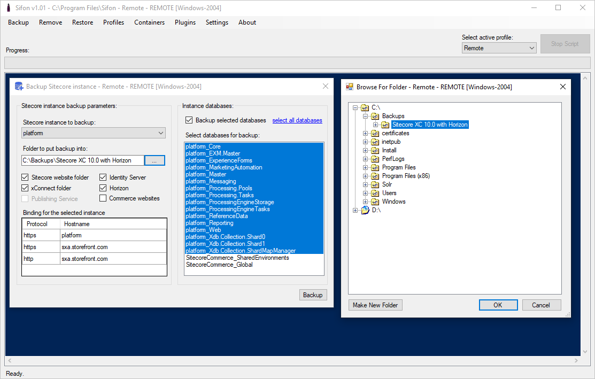
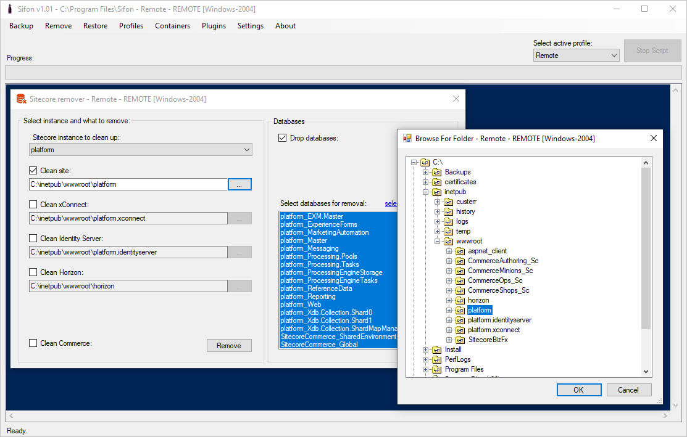
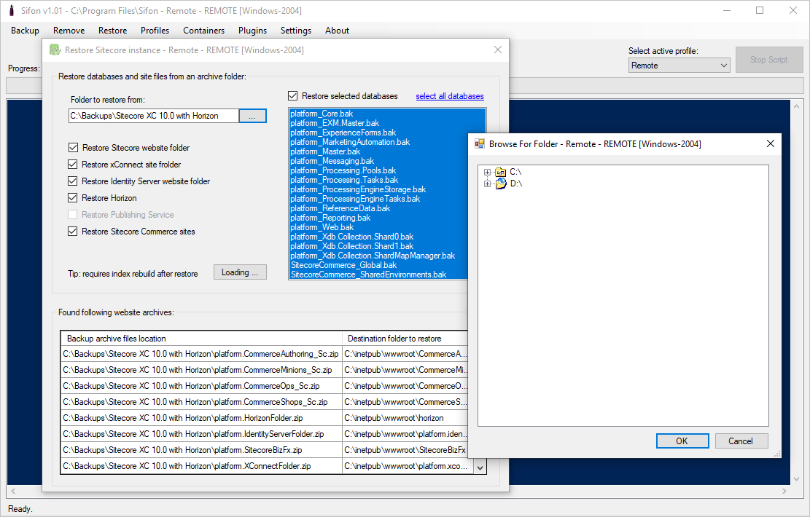

# Creating and restoring Sitecore instance backups

That is a default Sifon feature and is available out of the box. It obviously works for both local and remote profiles and does operations against one or many of the following:

Websites:

- main website, that has Sitecore installed
- XConnect website

Optional websites if installed:

- the website for Identity Server
- Publishing Service
- Horizon

Databases

- all the databases per instance that are prefixed with a value set as profile instance prefix.

Sitecore Commerce versions 9.x and 10.x

- all the Commerce websites
- two additional databases used by Sitecore XC

Performing each of them Sifon is intelligent enough to stop the related dependent services and start them again, when finished. There are 3 main operations as explained below.

 

## Backup

At this stage you can select in instance from dropdown you'd like to backup. The dropdown values are auto detected based on the parameters from a selected profile. The dialog window header contains information you may find helpful: a profile name, its type, and a machine hostname for executing against remote profiles.

Once chosen, you'll be able to define which part of a selected instance you want to backup. That includes individual websites and databases. Those websites not installed for a particular instance will be greyed out. It is quite common to select everything to take a universal backup - it won't take longer at all.

**Please note:** the backups folder is located at the same instance where you take backups from. You may need to take additional care to copy these backup files into a safe location to avoid the losses when that machine fails.

 

## Remove

Sometimes you just need to remove a Sitecore instance. You may already have taken backups of it and no longer need it up and running. 
This tool helps you doing that - removing it either entirely or partially.

This tool leaves IIS website records and HTTPS certificates untouched. When later one decides to restore a backup taken from that computer - it becomes easily possible to.

 

## Restore

No backups make sense without restoring them. 

This dialog allows selecting a folder with backup files and choose what exactly to be restored. Once a folder is selected, Sifon shows you the resources it finds and where those to be restored. You may select just a specific website folder backup or database to be restored, or as many of them as you want.

  

[<- Home](/ "Home")	
