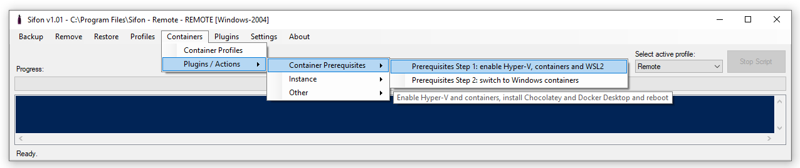
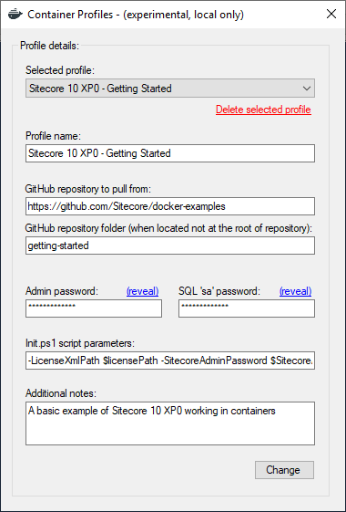
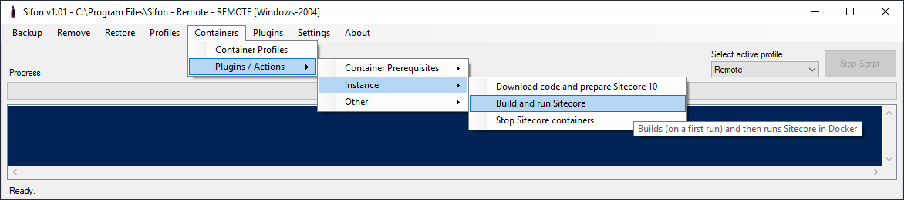

# Containers in Sifon

Now Sifon allows doing basics with containers in Sitecore 10.* - in fact, that is just a wrapper over the most of commands and operations. That is especially helpful for the beginners (see below why it is so).

 

## Installing Docker and the prerequisites

There are 2 plugins in the Public Community Plugins Library that help to quick start with containers. The first does the whole preparation, installation, and configuration for you, followed by a machine restart.

The second script switches Docker to Windows Containers, as those being used by Sitecore images.

 

## Creating Container Profiles

That works similar to normal profiles in Sifon, however both features do not intersect. The same idea of creating a profile as a set of environmental  settings to be easily switch is implemented for container profiles.

Out of the box Container Profiles comes with two predefined profiles: 'Sitecore 10 XP - Getting Started' and 'Lighthouse'. For a quick start, I would recommend starting with one of them before implementing solutions in containers. Please also familiarize yourself with more details on these solutions from their official repositories:

- [https://github.com/Sitecore/docker-examples](https://github.com/Sitecore/docker-examples "Docker Examples")
- [https://github.com/Sitecore/Sitecore.Demo.Platform](https://github.com/Sitecore/Sitecore.Demo.Platform "Lighthouse")

 

## Container Profiles

This is how you can build, run and stop an instance containers with Sifon

**Please note:** these commands apply to an environment from a selected containers profile. The very first run will take a while, as container images need to get downloaded to your host machine.

 

[<- Home](/ "Home")	
