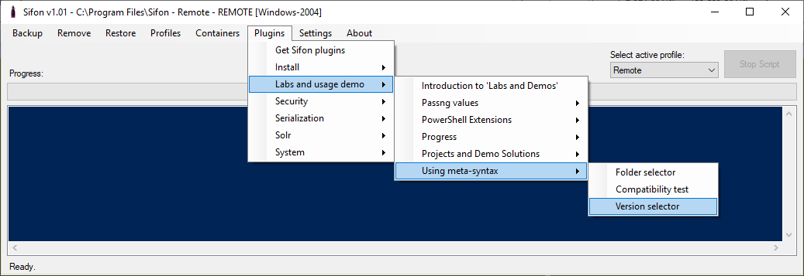

# Labs and Demo

To help getting on making your own script for Sifon, the public community plugins library has a section called 'Labs and Demo'. 

You may find different example and blueprints performing some scripting functionality.

 

*Please make sure you run "Introduction to 'Labs and Demos'" first.*

 

[<- Home](/ "Home")	
