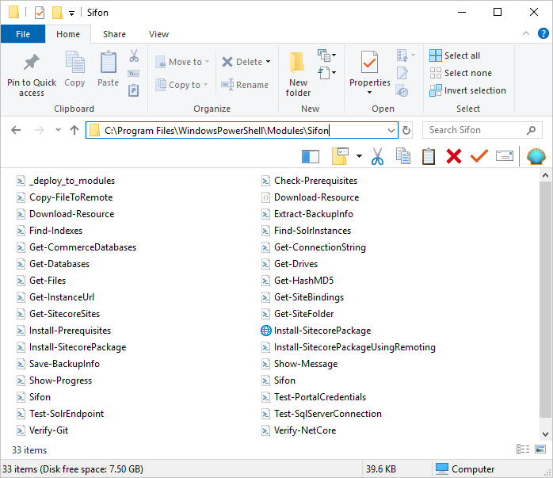

# Sifon module

On a first run there is Sifon module being installed into modules directory `c:\Program Files\WindowsPowerShell\Modules\Sifon` at the local machine. This module gets also installed to a remote machine when user 'Initializes' that machine on creating a remote profile.

This module gets uninstalled with Sifon uninstaller (or `choco ininstall` command), however only from local machine. 

<br/>

## Why Sifon needs a module?

Both Sifon own scripts and plugins (including those done by you) rely on a set of repetitive functions to be executed from time to time. 

Why would one copy paste the same code repeatedly instead of creating a reusable PowerShell module?

<br/>

## What does module actually do?

The function names are self-explanatory at their majority:

```
'Copy-FileToRemote', 'Download-Resource', 'Get-ConnectionString', 'Get-InstanceUrl', 'Get-SiteFolder', 'Install-SitecorePackage', 'Install-SitecorePackageUsingRemoting', 'Verify-PortalCredentials', 'Get-SiteBindings', 'Get-SitecoreSites', 'Get-Databases', 'Get-CommerceDatabases', 'Test-PortalCredentials', 'Test-SqlServerConnection', 'Extract-BackupInfo', 'Save-BackupInfo', 'Find-SolrInstances', 'Test-SolrEndpoint', 'Get-Drives', 'Get-Files', 'Get-HashMD5', 'Install-Prerequisites', 'Check-Prerequisites', 'Verify-Git', 'Show-Message', 'Find-Indexes', 'Show-Progress', 'Verify-NetCore'
```

You may take your own study on a content of each individual module files (and pull-request anything you'd think could be improved there).



<br/>
[<- Home](/ "Home")	
