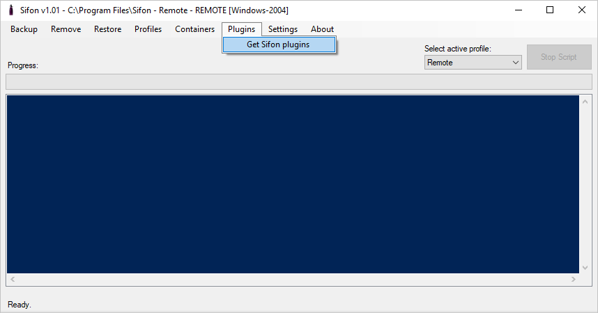
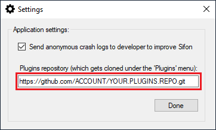

# Plugins library

<!-- The range of potential use cases where a plugin could be written is wider than my imagination, so I am writing the list of plugins to create, oj just simply areas to think about. Please let me know if  you have some ideas,so that I can add them to a wish-list. -->

One of the best features of Sifon it its extensibility with plugin. Plugins help to separate actual business logic, from the parameters, environmental variables, and sensitive credentials. An individual can focus on implementing business code, while Sifon cares of the rest passing into the plugin script.

At the simplest case, any PowerShell script is already a valid plugin. Just simply placing it under `Sifon.Plugins` folder will make it seen from under *Plugins* menu in the application. In that case, Sifon just execute this script. What is important to understand at this stage - this script will be run in a context of a current profile.

A profile is a set of environmental settings that point to a specific Sitecore instance. It can be either local or remote. While local profiles execute in a context of that same machine Sifon is running on, remote profiles are slightly different beasts. Those use WinRm/WsMan protocol to execute PowerShell script **at** the remote machine. 

 

## How do I create my own plugin?

There is a comprehensive article with more details on all aspects of [creating your own Sifon plugin](CreatingPlugin.md "creating your own Sifon plugin").

 

## Community Plugins Library

There is an existing plugins community library, located at [https://github.com/MartinMiles/Sifon.Plugins](https://github.com/MartinMiles/Sifon.Plugins "https://github.com/MartinMiles/Sifon.Plugins"). Scripts there are provided under MIT license.

Everyone is welcomed to contribute ,please send your pull requests!
Just imagine when hundreds of people each automating some of his/her day-to-day issues and sharing the resulting script in a form of a plugin for Sifon. That means everyone can benefit from the resulting library, by simply getting Plugin Library into Sifon which will care about the parameters and credential.

 

## Getting existing Plugins Library into Sifon

On a first run 'Plugins' menu item will suggest user getting the plugin library:

You may use the same menu item for updating the scripts at your local copy of library from time to time.

## If you want using your own scripts library

That's doable from the 'Settings' -> 'Application Settings' menu item, where you may change the value for `Plugins repository` field.

**Please note:** a repository should point to a public repository at GitHub

 

## Example of plugins in action

Please find some examples of existing plugins in action. Those and many others are already available from the [Community Plugins Library](https://github.com/MartinMiles/Sifon.Plugins "Community Plugins Library"):

#### A demo of how plugins work with Sifon on an example of Publishing Service installation

<iframe width="800" height="450" src="https://www.youtube.com/embed/_wClAjFrFLg?feature=oembed" frameborder="0" allow="accelerometer; autoplay; encrypted-media; gyroscope; picture-in-picture" allowfullscreen></iframe>

 

#### Another demo of Horizon 10.0 installation using a plugin

<iframe width="800" height="450" src="https://www.youtube.com/embed/YINq7sIlV6Q?feature=oembed" frameborder="0" allow="accelerometer; autoplay; encrypted-media; gyroscope; picture-in-picture" allowfullscreen></iframe>

 

[<- Home](/ "Home")	
