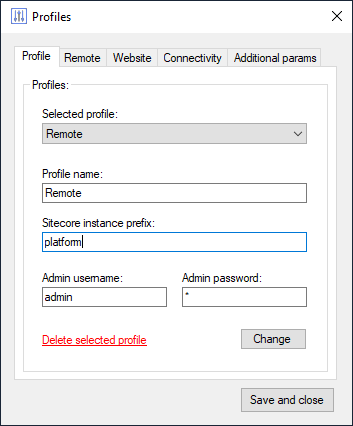
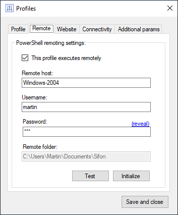
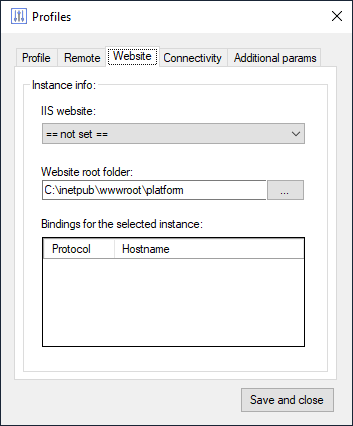
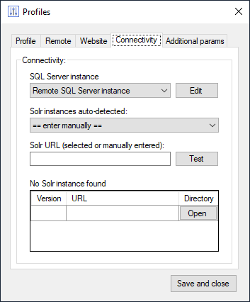
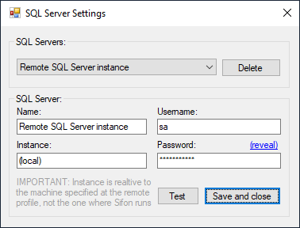
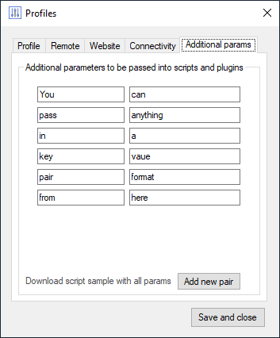

# Understanding Profiles

A profile is a set of environmental settings that point to a specific Sitecore instance. It can be either local or remote. While local profiles execute in a context of that same machine Sifon is running on, remote profiles are slightly different beasts. Those remote profiles use WinRm/WsMan protocol in order to execute PowerShell script **at** the remote machine. 

Unless you're working solely with containers, you must have at least one profile created. Most of the features including making and restoring backups, executing plugins require a profile to get the parameters from, therefore won't become available until a profile is created.

## Creating a profile

Clicking 'Profiles' menu item brings you to a Profile Editor, split into 5 areas each under its own tab. Let take a look at them:

### Profile tab

It is the first screen where you provide the name of profile to be used across Sifon, an instance prefix and admin username and password for that Sitecore instance.
An instance is the parameter used by SIF installation script to generate assets. Even when not having that installer parameter at hands, one may still easily guess it out.

**Example 1:**

There are 2 websites under IIS: `Platform.dev.local` and `Platform_xconnect.dev.local` and also several Sitecore databases `Platform_Core`, `Platform_Master` etc. The instance prefix is `Platform`.

**Example 2:**

There are 3 websites under IIS: `DigitalEcosystem.local` and `DigitalEcosystem_xconnect.local` and the databases `DigitalEcosystem_Core`, `DigitalEcosystem_Master` etc. Obviously, the instance prefix is `DigitalEcosystem`.

### Remote tab

*For local profiles it does not make any sense, so you may just skip it.*

This is where you specify the parameters for a remote host to execute your scripts and perform backup and restore operations. In order to setup a remote profile one needs:

- check the box 'This profile executes remotely'
- provide the hostname or IP address for a remote machine
- add username and password for the remote machine security
- clicking test button will try connecting the host with provided params and show you if that works
- once tested, you need to initialize a remote machine before first use

When initializing, two things are happening:
- a Sifon folder is created under users Documents folder to be used for caching
- also, Sifon PowerShell module is installed to that machine with most utilities' operations Sifon relies to

**Please note:** Sifon PowerShell module also get removed when you uninstall Sifon.

### Website tab

At this stage user defines IIS website to use with a given profile. An auto-detection is here to help with suggesting found Sitecore instances at the local or remote machine (depending on a profile type).
Picking up a Sitecore website from a dropdown also updates its webroot folder and shows up all the HTTP bindings for that website.

### Connectivity tab

This tab is for providing connections to SQL Server and Solr for a desired profile. 

There is a separate 'SQL Server Settings' screen to set up the connection:

**Please note:** when using a remote profile *Instance* parameter is set relative to a remote machine named at *Remote* tab, not the one Sifon is running at. As at example above, *Instance* having the value `(local)` means that SQL Server is installed on that remote machine (in other words - local to a profile).

To set up a Solr endpoint there is an auto-detection helper checking all the open ports at either local or remote machine, depending on the profile tab. Once done Sifon populates the dropdown with all Solr endpoint found for that machine. There were known cases of having 3 different versions of Solr running at the same machine for different instances of Sitecore and that's a perfectly valid scenario.

If no Solr endpoints found or Solr is running at an instance another than a set for a profile - then you can specify the endpoint at 'Solr URL' field. Same as said above for SQL - it is relative a profile instance (and not the one Sifon if physically running at for remote profiles). 

It is also possible to test Solr connectivity before saving a profile.

**Note:** Azure Search is not supported by Sifon and is deprecated from Sitecore in versions 10.*

### Additional params tab

This is an optional stage where user may want to specify some additional profile parameters to be passed into an executed plugin. It is possible to specify any number of parameters provided in a key-value format.

  
[<- Home](/ "Home")	
