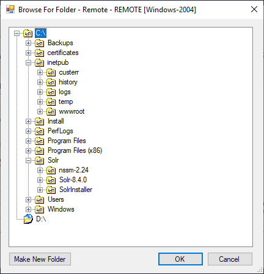

# Folder Browser

This control allows selecting a folder on a machine referenced at current profile (either local or remote). In case of remote profile, it represents a filesystem from that remote machine and allows interact with it.

**Namespace:** `Sifon.Shared.Forms.FolderBrowserDialog`

**Class type:** `FolderBrowser`

**Usage from meta-language:**

```
### $SelectedFolder = new Sifon.Shared.Forms.FolderBrowserDialog.FolderBrowser::GetFolder($Profile, $true)

param([string]$SelectedFolder) # an example of receiving this parameter into a plugin script
```

<br/>

### Preview

 


<br/>

[<- Home](/ "Home")	

<hr>

<footer>
<p style="float:left; width: 20%;">
</p>
<p style="float:left; width: 60%; text-align:center;">Copyright &copy; <a href="https://blog.MartinMiles.net">Martin Miles</a>, 2020</p>
<p style="float:left; width: 20%;">
</p>
</footer>