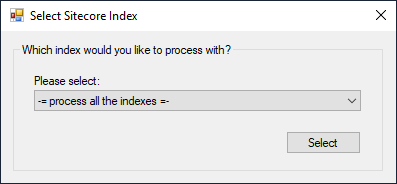

# Index Selector

Retrieve all the indexes for a given Sitecore instance based on the parameters from a selected profile. Represents them in a dropdown for user to select either a specific index to process or all at the same time.

**Namespace:** `Sifon.Shared.Forms.IndexSelectorDialog`

**Class type:** `IndexSelector`

**Usage from meta-language:**

```
### $Indexes = new Sifon.Shared.Forms.IndexSelectorDialog.IndexSelector::GetIndex($Profile)

param([string[]]$Indexes) # an example of receiving this parameter into a plugin script
```

<br/>

### Preview

 


<br/>

[<- Home](/ "Home")	

<hr>

<footer>
<p style="float:left; width: 20%;">
</p>
<p style="float:left; width: 60%; text-align:center;">Copyright &copy; <a href="https://blog.MartinMiles.net">Martin Miles</a>, 2020</p>
<p style="float:left; width: 20%;">
</p>
</footer>