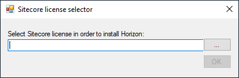

# Local File Picker

Sometimes you need to pick up a file from your local machine and pass it to the script regardless of your profiles being either local or remote. As a good example it may be a picking up a license file from your local machine and uploading it to a remote machine (of your remote profile) and then passing the location of that uploaded file (as it is located on remote machine) into your script. 

There is no need to implement the above logic yourself - *LocalFilePicker* control does that all for you.


**Namespace:** `Sifon.Shared.Forms.LocalFilePickerDialog`

**Class type:** `LocalFilePicker`

**Usage from meta-language:**

```
### $SelectedFile = new Sifon.Shared.Forms.LocalFilePickerDialog.LocalFilePicker::GetFile("Sitecore license selector","Select Sitecore license in order to install Horizon:","License files|*.xml","OK")

param([string]$SelectedFile) # an example of receiving this parameter into a plugin script
```

<br/>

### Preview

 


<br/>

[<- Home](/ "Home")	

<hr>

<footer>
<p style="float:left; width: 20%;">
</p>
<p style="float:left; width: 60%; text-align:center;">Copyright &copy; <a href="https://blog.MartinMiles.net">Martin Miles</a>, 2020</p>
<p style="float:left; width: 20%;">
</p>
</footer>