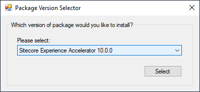

# Package Version Selector

**Namespace:** `Sifon.Shared.Forms.PackageVersionSelectorDialog`

**Class type:** `PackageVersionSelector`

**Usage from meta-language:**

```
### $Urls = new Sifon.Shared.Forms.PackageVersionSelectorDialog.PackageVersionSelector::GetFile("$PSScriptRoot\Install-JSS.json")

param([string[][]]$Urls) # an example of receiving this parameter into a plugin script
```

Method 'GetFile' accepts a parameter of a json file storing the list of assets for a specific package to choose from in order to be installed eventually. 

The output variable `$Url` is a 2-dimensional array of key-value pairs for a selected package and all the dependencies for the installation, where key contains a user-friendly name of a package or a dependency and the value stores URLs of the resources.

<br/>

### Preview

 


<br/>

[<- Home](/ "Home")	

<hr>

<footer>
<p style="float:left; width: 20%;">
</p>
<p style="float:left; width: 60%; text-align:center;">Copyright &copy; <a href="https://blog.MartinMiles.net">Martin Miles</a>, 2020</p>
<p style="float:left; width: 20%;">
</p>
</footer>