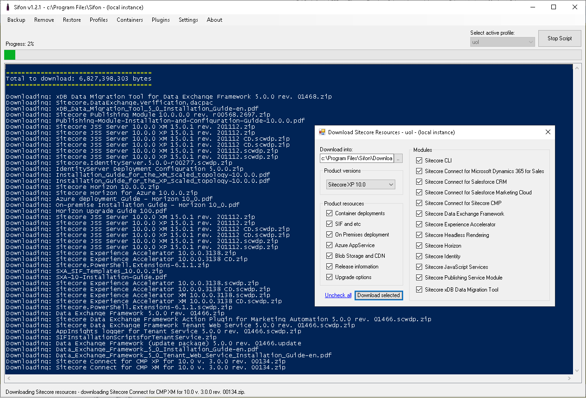
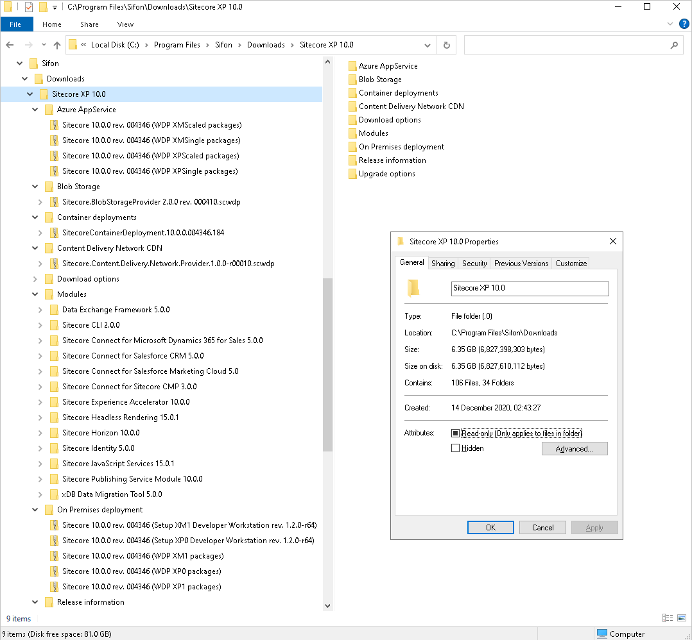

# Sitecore Resources Downloader

Now it becomes possible to download all the resources for a particular version of Sitecore! 

This shared API control helps choosing what parts of Sitecore to download for which particular version.

 

**Please note:** currently only Sitecore version **10.0** is supported. More versions will be available in future.

Here is an example of **Sitecore Resources Downloader** execution for downloading the entire Sitecore 10.0 assets. 106 files have been downloaded with total size of 6.35 GB

 

Amazing, isn't it? Why didn't I have it before?

 

[<- Home](/ "Home")	

<footer>

Copyright &copy; <a href="https://blog.MartinMiles.net">Martin Miles</a>, 2020

</footer>