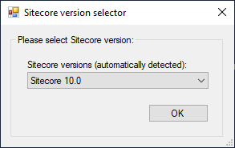

# Sitecore Version Selector

Sometimes you need to give script user an option of choosing a specific Sitecore version to be passed ahead for some specific script needs. 

**Namespace:** `Sifon.Shared.Forms.SitecoreVersionSelectorDialog`

**Class type:** `SitecoreVersionSelector`

**Usage from meta-language:**

```
### $SelectedVersion = new Sifon.Shared.Forms.SitecoreVersionSelectorDialog.SitecoreVersionSelector::GetVersion("$Webroot\bin\Sitecore.Kernel.dll", "Sitecore version selector", "Please select Sitecore version:", "OK", $Profile)

param([string]$SelectedVersion) # an example of receiving this parameter into a plugin script
```

<br/>

### Preview

 


<br/>

[<- Home](/ "Home")	

<hr>

<footer>
<p style="float:left; width: 20%;">
</p>
<p style="float:left; width: 60%; text-align:center;">Copyright &copy; <a href="https://blog.MartinMiles.net">Martin Miles</a>, 2020</p>
<p style="float:left; width: 20%;">
</p>
</footer>