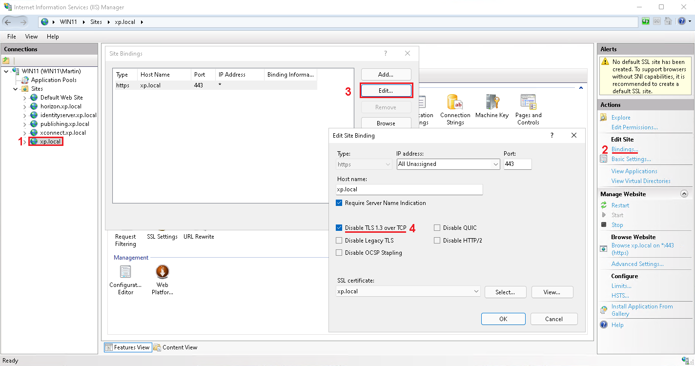

# Windows 11 support

Latest Sifon 1.2.5 and newer run on Windows 11 natively.

In fact, it is the one (if not only) installers that allows you installing and maintaining Sitecore 10.2 on Win11 as well as related modules.

 

**Tip:** upon the installation if Marketing Automation does not start, please do the following:

.. and then manually start Marketing Automation service or restart Windows.

  
[<- Home](/ "Home")	
